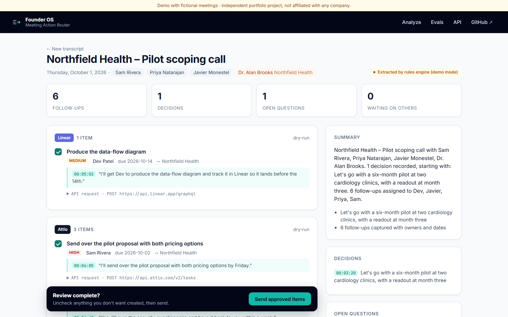
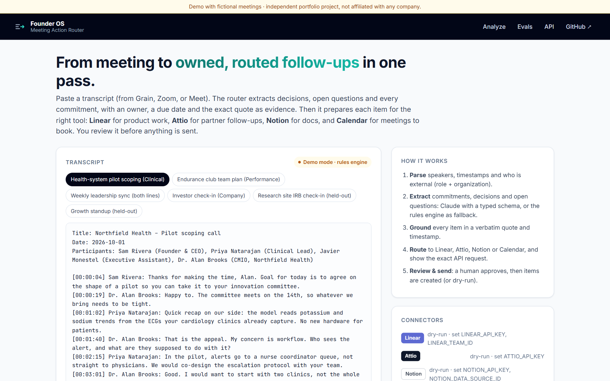
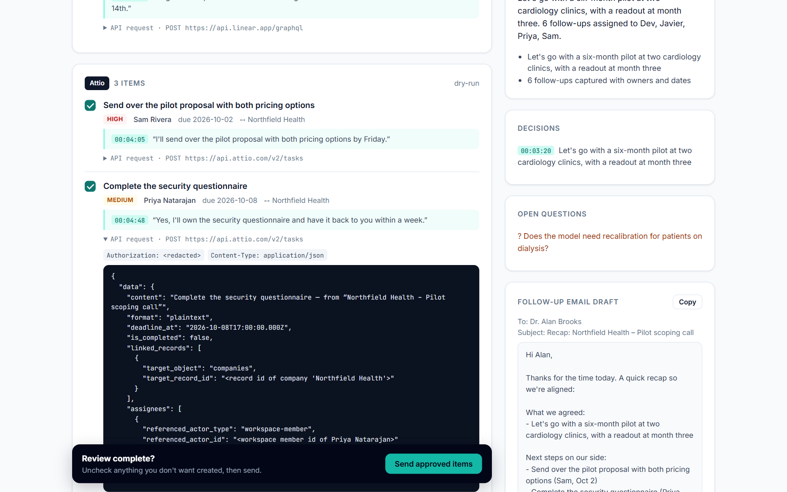
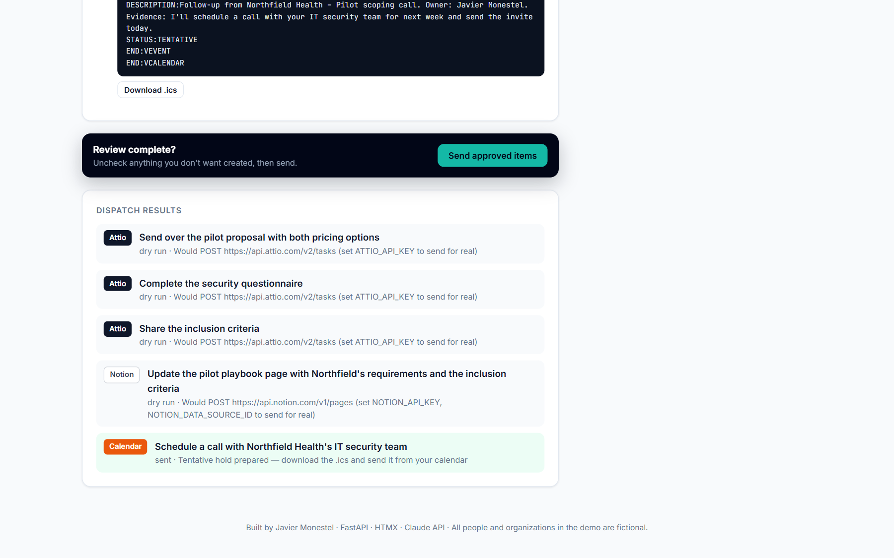
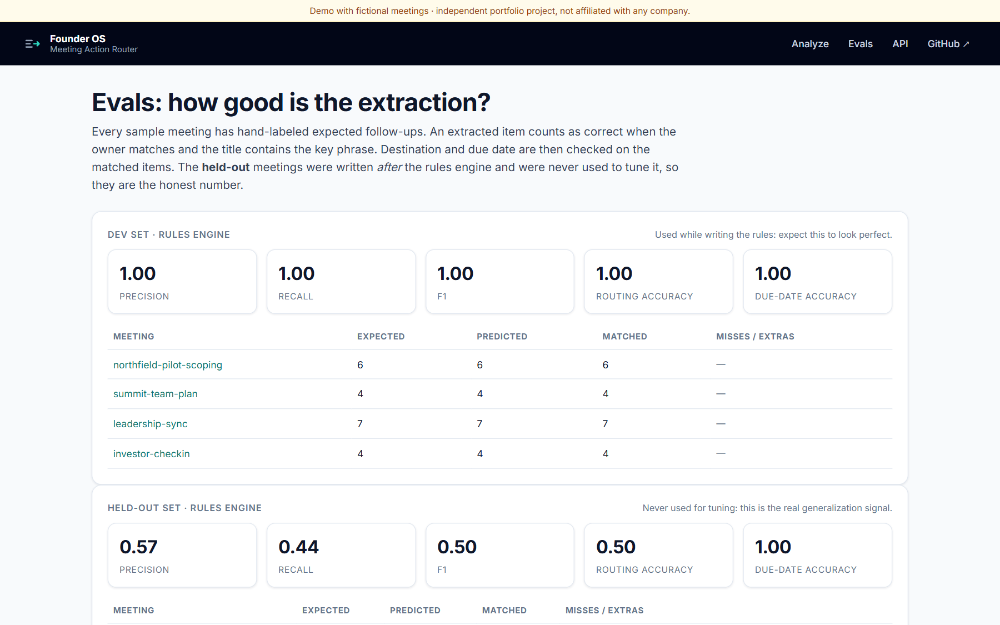

# Meeting Action Router

**Turn a meeting transcript into owned, dated, evidence-backed follow-ups, routed to the right tool.**
Commitments go to Linear (product work), Attio (partner, customer and investor follow-ups), Notion (docs) and Calendar (meetings to book). A human reviews every item before anything is sent.

[](https://meeting-action-router.vercel.app)
[](https://github.com/JavierMonestel/meeting-action-router/actions/workflows/ci.yml)




> **Try it:** [meeting-action-router.vercel.app](https://meeting-action-router.vercel.app). Pick a sample meeting, click **Analyze**, expand any item to see the exact API request, uncheck what you don't want, and **Send**. The hosted demo runs every connector in dry-run, so no real workspace is touched. The interactive API docs are at [`/docs`](https://meeting-action-router.vercel.app/docs).

---

## The problem

A founder with two business lines spends their day in meetings with health systems, research sites, athlete clubs, investors and their own team. Each meeting creates five or more commitments, and they scatter:

- engineering asks belong in **Linear**,
- partner promises belong on the right company record in **Attio**,
- doc updates belong in **Notion**,
- and "let's set up a call" belongs on a **calendar**.

Meeting recorders like Grain produce good transcripts and summaries, but **someone still has to turn them into owned, dated tasks in the right system**. That is usually the executive assistant's job. This project automates the boring 90% of it and keeps a human in the loop for the last 10%.

## What it does

| Step | What happens |
|---|---|
| **Parse** | Reads a Grain-style transcript: speakers, timestamps, and who is external (role and organization). |
| **Extract** | Finds commitments ("I'll …", "Javier, can you …?" → "Will do", "I'll get Dev to …"), decisions and open questions. |
| **Ground** | Every action item carries the **verbatim quote and timestamp** it came from, so nothing is invented and anything can be checked in seconds. |
| **Route** | Classifies each item to Linear, Attio, Notion or Calendar, and builds the **exact API request** (Linear GraphQL `issueCreate`, Attio v2 task linked to the company record, Notion page in a data source, `.ics` invite). |
| **Review & send** | A review screen with approve/uncheck per item, then dispatch. Connectors run **live when credentials are set**, and in dry-run otherwise. |
| **Recap** | Drafts a follow-up email to external attendees: what was agreed, our next steps with dates, and what we are waiting on from them. |

<table>
<tr>
<td width="50%"></td>
<td width="50%"></td>
</tr>
<tr>
<td><b>Paste or pick a meeting.</b> Six fictional samples across both business lines.</td>
<td><b>Every item shows its evidence and the exact request</b> that will be sent (secrets redacted).</td>
</tr>
<tr>
<td></td>
<td></td>
</tr>
<tr>
<td><b>Human-in-the-loop dispatch.</b> Only approved items are sent.</td>
<td><b>Built-in evals</b> with a dev set and an honest held-out set.</td>
</tr>
</table>

## AI design

- **Primary engine: Claude** (`claude-opus-5-5`) through the Anthropic Python SDK, using **structured outputs** (`messages.parse` with Pydantic models). The response is validated against the same `MeetingAnalysis` schema the rest of the app uses. The system prompt carries the team roster, the routing rules, the meeting date for resolving "by Friday", and a hard rule never to invent people, dates or commitments.
- **Server-side refusal fallback** (`fallbacks: "default"`), plus an application-level fallback: if the key is missing or the call fails, the **deterministic rules engine** takes over, so the product never breaks.
- **Evidence-first.** Each item must quote the transcript line it came from. The test suite checks that every quote really appears at its timestamp.

## Evals (and an honest number)

`python -m evals.run` scores an extractor against hand-labeled meetings. A match requires the same owner plus the key phrase in the title; routing and due-date accuracy are then measured on the matches.

| Rules engine | Precision | Recall | F1 | Routing | Due date |
|---|---|---|---|---|---|
| Dev set (4 meetings, used while building the rules) | 1.00 | 1.00 | **1.00** | 1.00 | 1.00 |
| **Held-out set** (2 meetings written afterwards, never tuned on) | 0.57 | 0.44 | **0.50** | 0.50 | 1.00 |

That gap is the point. Hand-written rules overfit to the phrasing they were built on ("Action item for me: …", "Let me log …" and third-person commitments slip through). This is why the production path is an LLM with a typed schema, and why the eval exists: the same harness scores Claude with `--engine claude`, so any prompt or model change can be measured instead of eyeballed. CI runs the eval on every push as a regression guard.

## API

FastAPI gives typed, self-documenting endpoints ([`/docs`](https://meeting-action-router.vercel.app/docs)):

| Endpoint | Purpose |
|---|---|
| `POST /api/analyze` | `{ transcript, meeting_date? }` → summary, decisions, open questions, action items and the routing plan |
| `POST /api/webhooks/grain` | Recorder-style webhook (title, participants, utterances). `auto_dispatch: true` sends without review. |
| `GET /api/health` | Engine in use and per-connector status (live / dry-run) |

```bash
curl -s https://meeting-action-router.vercel.app/api/analyze \
  -H "Content-Type: application/json" \
  -d '{"transcript":"[00:00:05] Ana Ruiz: Can you send the contract?\n[00:00:09] Sam Rivera: Yes, I'\''ll send the contract by Friday."}'
```

Typical automation: a **Grain → Zapier/Make/n8n → `/api/webhooks/grain`** step after each recording, with review links posted to Slack.

## Run it locally

```bash
git clone https://github.com/JavierMonestel/meeting-action-router.git
cd meeting-action-router
python -m venv .venv && source .venv/bin/activate   # Windows: .venv\Scripts\activate
pip install -r requirements-dev.txt
cp .env.example .env    # optional: ANTHROPIC_API_KEY, LINEAR_*, ATTIO_*, NOTION_*
uvicorn app.main:app --reload
```

| Variable | Effect |
|---|---|
| `ANTHROPIC_API_KEY` | Use Claude for extraction (otherwise the rules engine) |
| `LINEAR_API_KEY`, `LINEAR_TEAM_ID` | Create real Linear issues |
| `ATTIO_API_KEY`, `ATTIO_MEMBER_IDS` | Create Attio tasks linked to the company record and assigned to teammates |
| `NOTION_API_KEY`, `NOTION_DATA_SOURCE_ID` | Create pages in a Notion tasks data source |

```bash
pytest -q                 # 30 tests: parsing, dates, extraction, connectors, API
ruff check . && ruff format --check .
python -m evals.run       # dev + held-out report
```

## Project structure

```
app/
  main.py            FastAPI app: HTML (Jinja + HTMX) and JSON API
  transcript.py      Grain-style transcript parser
  extract_claude.py  Claude structured-output extractor
  extract_rules.py   deterministic fallback extractor
  dates.py           "by Friday", "end of next week", "before the 14th" → dates
  connectors/        linear · attio · notion · calendar (build request, send or dry-run)
  evaluation.py      scoring against golden labels
  samples/           fictional meetings (dev + held-out)
evals/run.py         CLI eval report (used in CI)
tests/               pytest suite
```

## Why these choices

- **FastAPI + HTMX** keep it a single deployable Python service with a responsive UI and no frontend build step.
- **Stateless by design.** The review page carries its own items, so it runs on serverless (Vercel) with no database.
- **Dry-run first.** Building and showing the exact request before sending is what makes automation trustworthy for a small team.

---

**Built by [Javier Monestel](https://github.com/JavierMonestel)** as part of a portfolio on AI-native operations for an early-stage, two-vertical health-tech company.
*Independent project. Not affiliated with, endorsed by, or built for any company. All meetings, people and organizations in the demo are fictional.*
